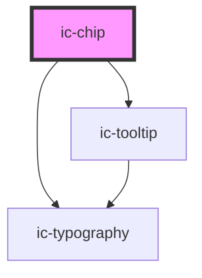

# ic-chip

<!-- Auto Generated Below -->

## Properties

| Property             | Attribute        | Description                                                                                     | Type                                                                                                                                                                                     | Default     |
| -------------------- | ---------------- | ----------------------------------------------------------------------------------------------- | ---------------------------------------------------------------------------------------------------------------------------------------------------------------------------------------- | ----------- |
| `appearance`         | `appearance`     | The emphasis of the chip.                                                                       | `"filled" \| "outline"`                                                                                                                                                                  | `"filled"`  |
| `clickable`          | `clickable`      | If `true`, the chip will be clickable instead of static.                                        | `boolean`                                                                                                                                                                                | `false`     |
| `disabled`           | `disabled`       | If `true`, and the chip is clickable, it will be disabled.                                      | `boolean`                                                                                                                                                                                | `false`     |
| `dismissible`        | `dismissible`    | If `true`, the chip will have a close button at the end to dismiss it.                          | `boolean`                                                                                                                                                                                | `false`     |
| `href`               | `href`           | The URL for clickable chips.                                                                    | `string`                                                                                                                                                                                 | `undefined` |
| `hreflang`           | `hreflang`       | The human-readable explanation of the URL.                                                      | `string`                                                                                                                                                                                 | `""`        |
| `label` _(required)_ | `label`          | The text rendered within the chip.                                                              | `string`                                                                                                                                                                                 | `undefined` |
| `referrerpolicy`     | `referrerpolicy` | How much of the referrer to send when following the link.                                       | `"" \| "no-referrer" \| "no-referrer-when-downgrade" \| "origin" \| "origin-when-cross-origin" \| "same-origin" \| "strict-origin" \| "strict-origin-when-cross-origin" \| "unsafe-url"` | `undefined` |
| `rel`                | `rel`            | The relationship of the linked URL as space-separated link types.                               | `string`                                                                                                                                                                                 | `undefined` |
| `size`               | `size`           | The size of the chip.                                                                           | `"default" \| "large" \| "small"`                                                                                                                                                        | `"default"` |
| `target`             | `target`         | Where to display the linked URL, as the name for a browsing context (a tab, window, or iframe). | `string`                                                                                                                                                                                 | `undefined` |

## Events

| Event     | Description                                  | Type                |
| --------- | -------------------------------------------- | ------------------- |
| `dismiss` | Is emitted when the user dismisses the chip. | `CustomEvent<void>` |

## Slots

| Slot     | Description                                        |
| -------- | -------------------------------------------------- |
| `"icon"` | Content will be rendered at the start of the chip. |

## Dependencies

### Depends on

- [ic-typography](../ic-typography)
- [ic-tooltip](../ic-tooltip)

### Graph

----------------------------------------------

